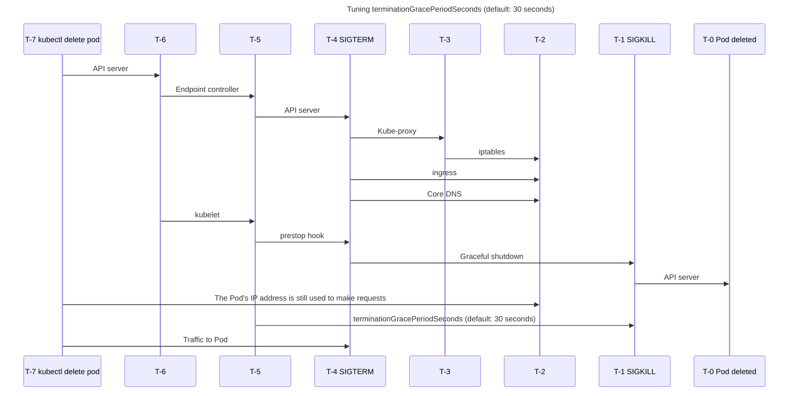

#### Further reading

- [Graceful shutdown and pod termination](https://github.com/puma/puma/blob/master/docs/kubernetes.md#graceful-shutdown-and-pod-termination)
- [https://learnk8s.io/graceful-shutdown](https://learnk8s.io/graceful-shutdown)
