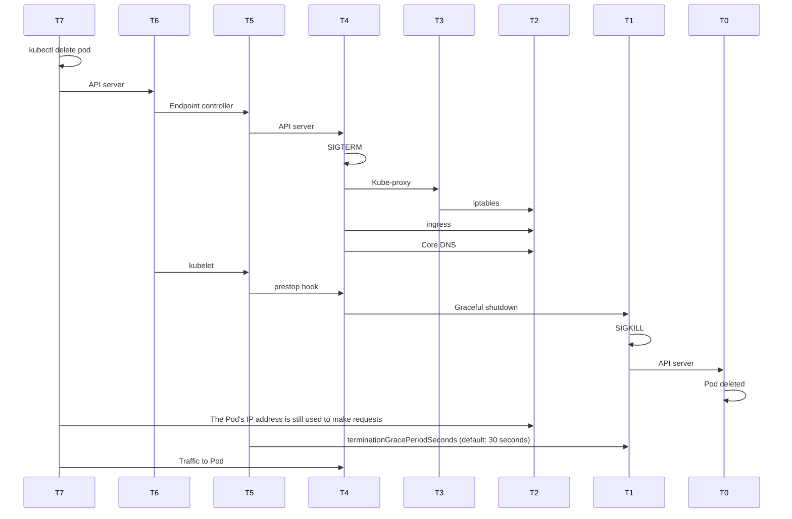

#### Tuning terminationGracePeriodSeconds (default: 30 seconds)

#### Further reading

- [kubeconfig for an Amazon EKS cluster](https://docs.aws.amazon.com/eks/latest/userguide/create-kubeconfig.html)
- [Graceful shutdown and pod termination](https://github.com/puma/puma/blob/master/docs/kubernetes.md#graceful-shutdown-and-pod-termination)
- [https://learnk8s.io/graceful-shutdown](https://learnk8s.io/graceful-shutdown)
